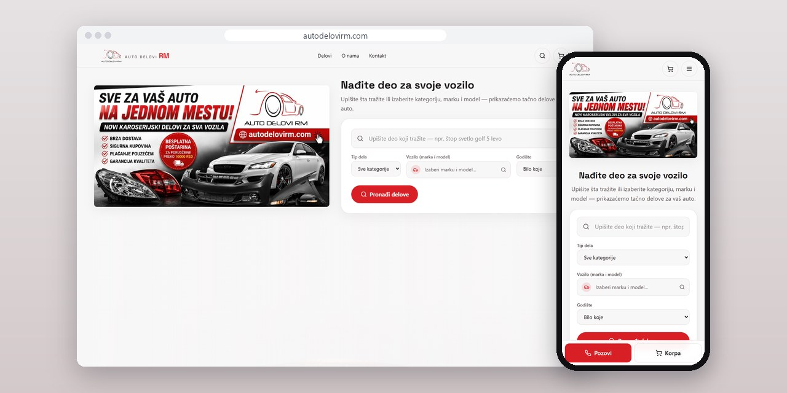
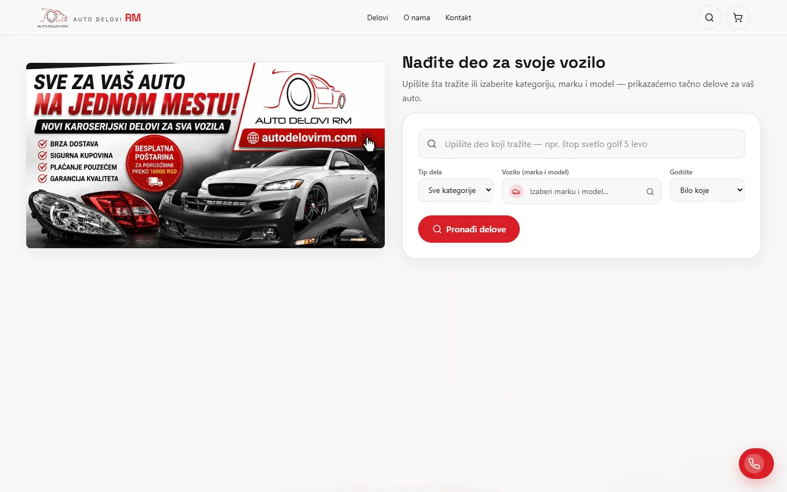
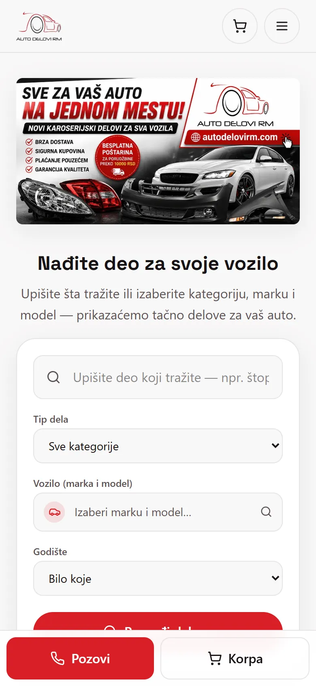
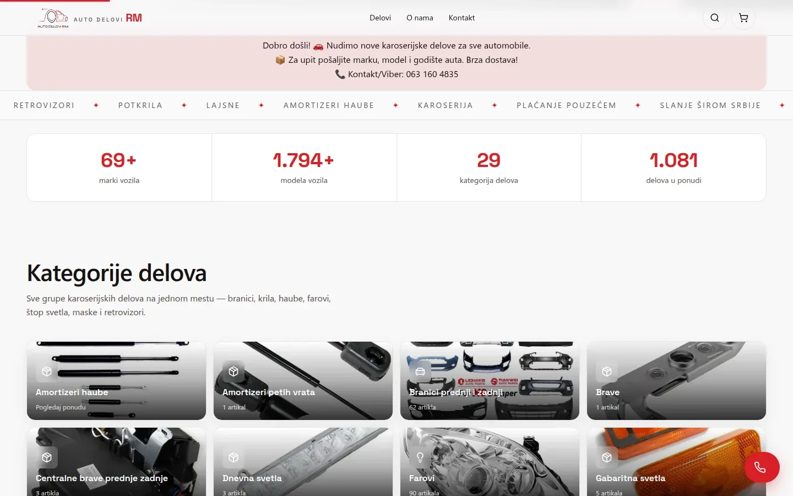
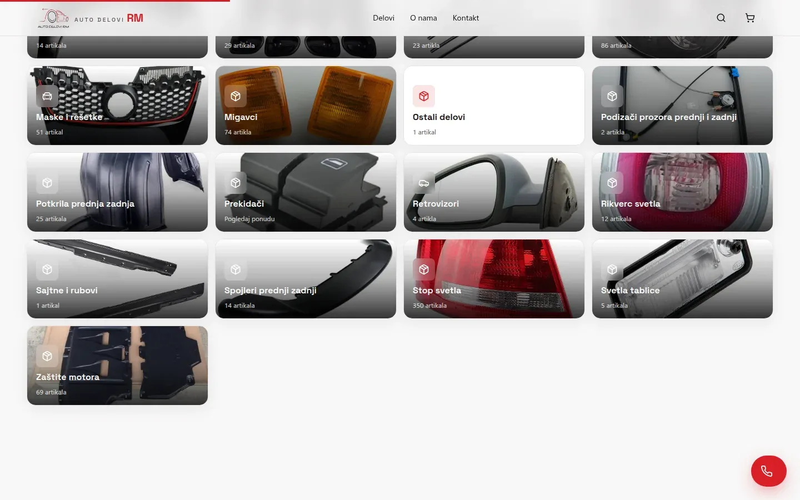

# Auto Delovi RM

Web prodavnica novih karoserijskih delova iz Zaječara, u kojoj kupac bira marku, model i godište i plaća pouzećem, bilo gde u Srbiji.

**[autodelovirm.com](https://autodelovirm.com/)** · [Studija slučaja](https://svilenkovic.rs/radovi/auto-delovi-rm) · [English](README.md)

> [!NOTE]
> Klijentski projekat. Izvorni kod pripada klijentu i čuva se u privatnom repozitorijumu. Ova stranica opisuje šta sam uradio i kako.

<table>
  <tr><td><b>Klijent</b></td><td>Auto Delovi RM</td></tr>
  <tr><td><b>Delatnost</b></td><td>Novi karoserijski delovi za putnička i laka komercijalna vozila</td></tr>
  <tr><td><b>Lokacija</b></td><td>Zaječar</td></tr>
  <tr><td><b>Vrsta</b></td><td>Web prodavnica sa admin panelom (PWA)</td></tr>
  <tr><td><b>Moj deo posla</b></td><td>Dizajn, izrada, SEO, hosting i održavanje</td></tr>
  <tr><td><b>Tehnologije</b></td><td>Next.js 15.5, React 19, TypeScript, Tailwind 4, three.js, React Three Fiber, GSAP, Lenis, SQLite, PWA</td></tr>
</table>

## O projektu

Auto Delovi RM prodaje nove karoserijske delove, od branika i krila do farova, štop svetala i retrovizora, i šalje ih kurirskom službom širom Srbije uz plaćanje pouzećem. Do ove prodavnice sve je išlo preko oglasne platforme, gde je konkurencija na istoj strani, a redosled tuđa odluka. Vlasnik je hteo svoj domen, posebnu stranu za svaki deo i panel koji vodi sam, sa telefona.

Najteže je bilo da auto kupca ne ispadne iz priče. Marka, model i godište upisuju se u adresu preko History API-ja, bez novog zahteva ka serveru, i prodavnica ih pamti. Ko podeli deo na Facebooku i posle se vrati, i dalje vidi delove za isti auto. Pretraga razume kako ljudi kucaju: prazne reči preskače, raspon kao 04-07 pretvara u filter za godište, a kataloški broj nalazi i sa razmacima i crticama i bez njih.

## Šta sam uradio

- Delovi po marki, modelu i godištu, uz strane koje pretraživač može da indeksira za svaku kategoriju, marku, model i njihove kombinacije
- Pretraga sa uskim grupama sinonima, unosom na ćirilici i rangiranjem po tome gde u nazivu dela stoji reč
- Porudžbina bez naloga: ime, telefon i adresa, plaćanje pouzećem, a ukupan iznos server ponovo računa iz svoje baze
- Admin panel kao PWA za delove, vozila, porudžbine, upite, reklamne pozicije i sav tekst sajta, sa kopiranjem jednog dela na više vozila i pregledom pre snimanja
- Scena puta u three.js-u iza naslovnog bloka radi samo na jačim računarima, a telefoni, slabiji hardver i posetioci koji su isključili animacije dobijaju statičnu sliku
- Naslov, opis i kanonska adresa vraćeni u `<head>` pošto je merenje pokazalo da ih Googlebot dobija tek posle oko 120.000 znakova dokumenta

## Merenja

| | Performanse | Pristupačnost | Dobre prakse | SEO |
| :-- | :-: | :-: | :-: | :-: |
| Telefon | 95 | 100 | 100 | 100 |
| Desktop | 91 | 100 | 100 | 100 |

PageSpeed Insights, laboratorijsko merenje živog sajta, septembar 2026. Sigurnosna zaglavlja: 6 od 6. HTML validator: bez grešaka. axe provera pristupačnosti: bez prekršaja. Strukturisani podaci: `AutoPartsStore`, `Store`.

## Snimci ekrana

<table>
  <tr>
    <td width="68%" valign="top"></td>
    <td width="32%" valign="top"></td>
  </tr>
</table>

Obim ponude i pregled svih grupa karoserijskih delova

Izdvojeno iz ponude: delovi koje vlasnik sam bira u panelu

---

Izrada: [D. Svilenković](https://svilenkovic.rs).
